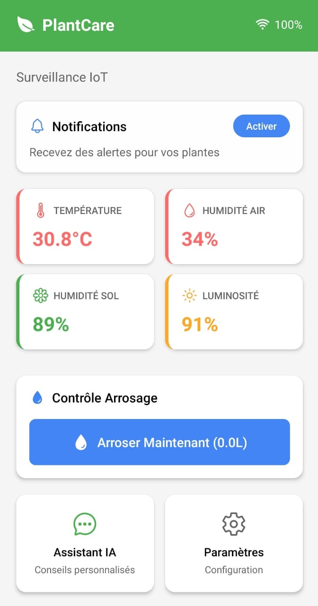

# 🌿 SmartPlantMonitor

**Surveillance intelligente de plantes** via un microcontrôleur **ESP32**, une application mobile **Expo React Native**, et **Firebase Realtime Database**.

## Matériel utilisé

- ESP32
- Breadboard
- Câbles Dupont
- Écran LCD I2C (16x2)
- Capteur de température et humidité **DHT11**
- Capteur d'humidité du sol
- Connexion Wi-Fi
- Application Expo Go (mobile)

##  Exécuter le code Arduino (.ino)

1. Ouvrir le fichier : `arduino/sketch_jun26a/sketch_jun26a.ino` dans Arduino IDE
2. Installer les bibliothèques nécessaires
3. Remplir les informations Wi-Fi et Firebase
4. Téléverser le code vers l'ESP32

## Créer une base de données Firebase Realtime Database

1. Créer un projet Firebase
2. Activer Realtime Database
3. Configurer les règles d'accès

##  Lancer l'application mobile (Expo)

### Prérequis
- Installer Node.js

### Installation
1. Se placer dans le dossier du projet :
```bash
npm install
```

2. Installer Expo CLI :
```bash
npm install -g expo-cli
```

3. Démarrer l'application :
```bash
npx expo start
```

4. Scanner le QR code avec l'application Expo Go (Android/iOS)

## 📊 Résultat attendu

- Les capteurs envoient les données à Firebase en temps réel
- 📱 L'application mobile affiche :
  - Température
  - Humidité de l'air
  - Humidité du sol
  - Besoin d'eau
-  L'écran LCD I2C affiche aussi les données localement



